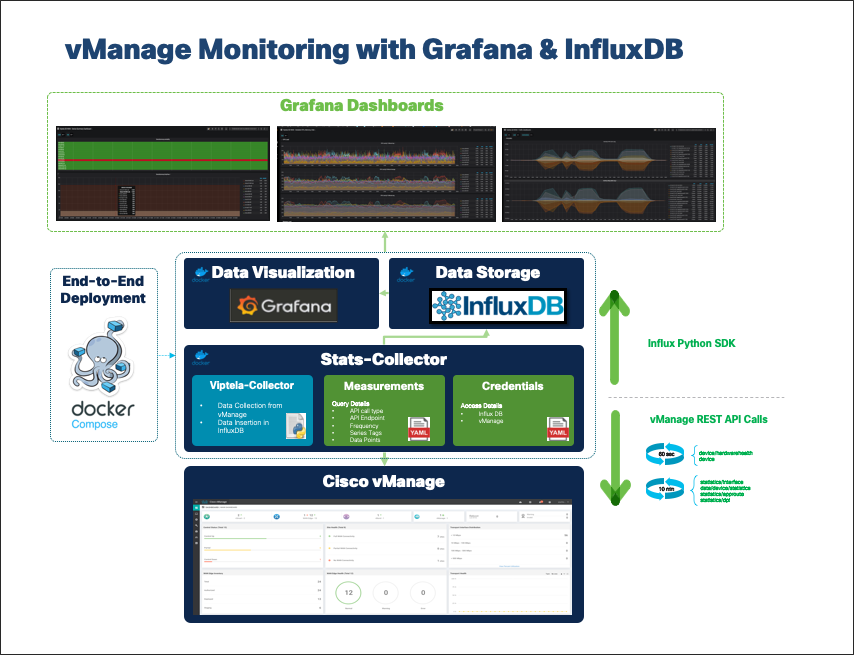

# **Cisco Viptela Monitoring w/ Grafana & Influx DB**

## Table of Contents <!-- omit in toc -->

- [**Cisco Viptela Monitoring w/ Grafana & Influx DB**](#cisco-viptela-monitoring-w-grafana--influx-db)
  - [**1. Overview**](#1-overview)
  - [**2. Installation**](#2-installation)
    - [**2.1 Step by Step Installation**](#21-step-by-step-installation)

## **1. Overview**

-----



-----

By default, 6 dashboards will be provisioned during the initial deployment of the Grafana container corresponding to 6 measurements:

| Dashboard Name            | vManage API Endpoint                                | Frequency   |
|---------------------------|-----------------------------------------------------|-------------|
| DeviceHardwareHealth      | device/hardwarehealth/detail                        | 60 seconds  |
| DeviceSummary             | device                                              | 60 seconds  |
| DeviceInterfaceStatistics | statistics/interface                                | 600 seconds |
| DeviceSystemStatusStats   | data/device/statistics/devicesystemstatusstatistics | 600 seconds |
| AppRouteStatsStatistics   | statistics/approute                                 | 600 seconds |
| DPIStatistics             | statistics/dpi                                      | 600 seconds |

<br>
Additionally the influxDB datasource is also automatically configured during the initial container build. Enabling/disabling or changing the frequency of data collection is possible by editing the stats-collector-code/measurements.yaml file. 
<br><br>

## **2. Installation**

* Step-0: Prerequisites:
  * docker (https://docs.docker.com/engine/install/)
  * docker-compose (https://docs.docker.com/compose/install/)
* Step-1: Clone the git repository on the target machine
* Step-2: Edit the ```stats-collector-code/credentials.yaml``` file and add the details of the target vManage instance.
* Step-3: Build the containers:
  * ```docker-compose up -d ```
* Step-4: Verify the containers are up and running: 
  * ```docker ps ```
  * ```docker-compose logs -f -t ``` (checks the container stack logs)


